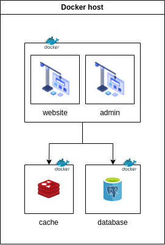

# Local Environment Setup

This repository contains a basic installation script to set up my personal website in a local environment easily

## Requirements

1. Docker
2. Docker compose plugin

## Local Environment Infrastructure



## Installation steps

1. Clone the repository `git clone https://github.com/smarulanda97/tiagocode-local-env.git`.
2. Move to the folder repository: `cd tiagocode-local-env`.
3. Copy the file environment file: `cp .env.example .env`.
4. Replace the variables within the environment file `.env`:
    - Replace the variable `{{ PROJECT_DIR }}`
    - Replace the variable `{{ PROJECT_NAME }}`
    - Replace the variable `{{ PHP_VERSION }}`
    - Replace the variable `{{ MEMCACHED_HOST }}`
    - Replace the variable `{{ DATABASE_HOST }}`
    - Replace the variable `{{ DATABASE_PORT }}`
    - Replace the variable `{{ DATABASE_CONNECTION }}`
    - Replace the variable `{{ DATABASE_NAME }}`
    - Replace the variable `{{ DATABASE_USER }}`
    - Replace the variable `{{ DATABASE_PASSWORD }}`
    - Replace the variable `{{ REDIS_HOST }}`
    - Replace the variable `{{ REDIS_PORT }}`
    - Replace the variable `{{ REDIS_PASSWORD }}`
    - Replace the variable `{{ REDIS_PORT }}`
    - Replace the variable `{{ REDIS_PASSWORD }}`
5. Execute the installation command: `make install`.
6. If the installation was successful, the output will look like the following: <br>
    ```bash
    NAME                           IMAGE                 COMMAND                  SERVICE             CREATED             STATUS              PORTS
    tiagocode-docker-in-docker-1   docker:20.10-dind     "dockerd-entrypoint.…"   docker-in-docker    23 seconds ago      Up 22 seconds       2375-2376/tcp
    tiagocode-php-fpm-1            tiagocode-php-fpm     "docker-php-entrypoi…"   php-fpm             23 seconds ago      Up 21 seconds       9000/tcp
    tiagocode-postgres-1           tiagocode-postgres    "docker-entrypoint.s…"   postgres            23 seconds ago      Up 21 seconds       0.0.0.0:5432->5432/tcp
    tiagocode-redis-1              tiagocode-redis       "docker-entrypoint.s…"   redis               23 seconds ago      Up 21 seconds       0.0.0.0:6379->6379/tcp
    tiagocode-workspace-1          tiagocode-workspace   "/sbin/my_init"          workspace           23 seconds ago      Up 21 seconds       0.0.0.0:3000-3001->3000-3001/tcp, 0.0.0.0:4200->4200/tcp, 0.0.0.0:5173->5173/tcp, 0.0.0.0:8080->8080/tcp, 0.0.0.0:2222->22/tcp, 0.0.0.0:8001->80
    ```

## Example .env file

```dotenv
# ENVIRONMENT BUILDER
ENV_DIR="/dir"
ENV_TYPE="type"
ENV_DOMAIN_NAME="domain_name"
ENV_DOMAIN_EXT="domain_ext"
ENV_REPOSITORIES_SOURCE="repositories_source"
ENV_REPOSITORIES="repositories"
ENV_DOCKER_DIR_NAME="docker_dir_name"

# TRAEFIK
ENV_TRAEFIK_HTTP_PORT=traefik_http_port
ENV_TRAEFIK_HTTPS_PORT=traefik_https_port

# DNS-01 CHALLENGE
ENV_ACME_EMAIL=acme_email
ENV_CLOUDFLARE_EMAIL=cloudflare_api_user
ENV_CLOUDFLARE_API_KEY=cloudflare_global_api_key
ENV_CLOUDFLARE_DNS=cloudflare_dns,cloudflare_dns

# CLEAN_DB_ON_INSTALL ONLY SUPPORTS TRUE/FALSE
ENV_CLEAN_DB_ON_INSTALL=clean_db_on_install

# DOCKER CONTAINERS TO ENABLE
ENV_DOCKER_CONTAINERS="docker_containers"

# PHP 8.2, 8.1, 7.4
ENV_PHP_VERSION=php_version

# MEMCACHED
ENV_MEMCACHED_HOST=memcached_host

# POSTGRES DATABASE
ENV_DATABASE_HOST=db_host
ENV_DATABASE_PORT=db_port
ENV_DATABASE_CONNECTION=db_connection
ENV_DATABASE_NAME=db_name
ENV_DATABASE_USER=db_user
ENV_DATABASE_PASSWORD=db_pass

# REDIS CLIENT
ENV_REDIS_HOST=redis_host
ENV_REDIS_PORT=redis_port
ENV_REDIS_PASSWORD=redis_password
```
